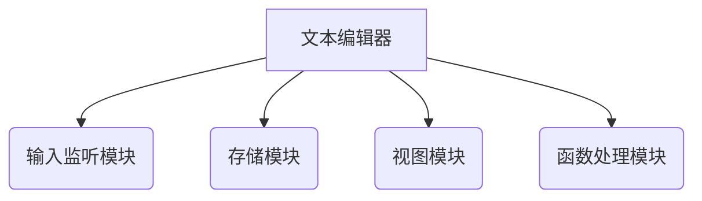

# 1 引言
## 1.1 标识
## 1.2 系统概述
## 1.3 文档描述
## 1.4 与其他计划之间的关系
## 1.5 基线
# 2 引用文件
# 3 交付产品
## 3.1 项目选取的生命周期
## 3.2 程序
## 3.3 文档
## 3.4 服务
## 3.5 验收标准
## 3.6 交付期限
# 4 所属工作概述
## 4.1 工作内容

系统总体功能分为四个模块

## 4.2 条件与限制

开发期限：21天

编程语言：javascript

开发环境：Window 10、Vscode

人员分工表如下

| 数据模型               | 人员   |
| ---------------------- | ------ |
| 数据模型（顶层）       | 黄子闻 |
| 数据模型（按功能模块） | 翁韬   |
| 逻辑模型顶层程序结构图 | 杨帅   |
| 功能模块               | 许文瑞 |
| 状态转移图             | 许晨阳 |

## 4.3 运行环境

1. 系统要求：Window 或 LInux 或Mac
2. 开发工具：Vscode、Typora

# 5 实施整个软件开发活动的计划
## 5.1 软件开发过程
## 5.2 软件开发总体计划
# 6 实施详细软件开发的活动计划
## 6.1 测试计划
## 6.2 质量保证计划
## 6.3 配置管理计划
## 6.4 人员培训计划
## 6.5 系统安装计划
# 7 进度表
## 7.1 总进度表
## 7.2 阶段计划进度表
# 8 项目组织和资源
# 9 培训
## 9.1 项目的技术要求
## 9.2 培训计划
# 10 项目估算
## 10.1 预算
## 10.2 关键问题
# 11 风险管理
# 12 组间沟通
# 13 注解
## 13.1 定义
## 13.2 参考资料
# 附录