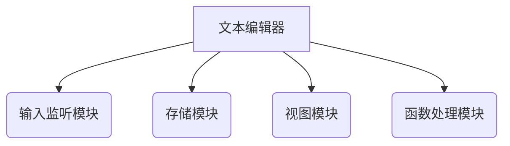

# 1 引言

在windows界面进行编辑的时候，拥有一个跨平台的文本编辑器。具有简洁直观的图形用户界面，同时能够进行简单的高亮提示，不再是冷冰冰的简单编辑，提高用户的编辑体验。

## 1.1 标识

本系统只适用于windows/Linuxs操作系统下安装及使用。 

文件状态： 报告编号 跨平台文件编辑器可行性分析报告 

- [    ]  草稿 TODO-001
- [ √ ]  正式发布 当前版本 V1.0
- [    ]  正在修改 编写人 许文睿 许晨阳 杨帅 黄子闻 翁韬

 编写日期 2020-4-25- 审批人 TODO小组 审批日期 2020-4-26 

## 1.2 系统概述

传统的文本编辑模式过于呆板，对于编辑人员不够友好。长时间的编辑状态下，单一的显示模式容易让人产生疲劳，并且不易试别，容易发生很多简单的编写错误。这一跨平台的文件编辑器，能够帮助编辑人员提供一个不同颜色的搭配，通过高亮标识，很容易看到是否出现错误。比较典型的如notepad++、VS Code、atom。为编辑者提供便利，提高生产效率。

## 1.3 文档描述

​	通过本次项目开发，深入了解跨平台文本编辑器的开发内容和运行过程，将所学的开发技术运行到项目中去，运用到Electron框架。

## 1.4 与其他计划之间的关系

提前撰写好系统的可行性分析报告，随后进行软件开发计划书、需求规格说明书的撰写。之后在设计阶段完成概要设计说明书、详细设计说明书；在完成编码阶段之后，撰写软件测试计划，在软件测试之后完成测试分析报告。完成测试任务后，撰写项目开发总结报告，同时编辑用户手册。

## 1.5 基线

1.跨平台编辑器可行性分析报告 V1.0

# 2 引用文件

计算机软件文档编制规范（GB/T 8567-2006),2006年3月14日发布，2006年7月1日实施。

# 3 交付产品
## 3.1 项目选取的生命周期

充分考虑到时间与项目规模，且由于功能点较多，该项目使用增量开发模型。

## 3.2 程序

交付的程序名称：TODO

使用的语言：node.js

## 3.3 文档

- 软件开发计划书
- 需求规格说明书
- 系统分析文档
- 设计说明书
- 软件测试计划
- 测试分析报告
- 用户手册
- 项目开发总结报告

## 3.4 服务

提供完整的用户手册与案例供使用者学习。

## 3.5 验收标准

提供4个必要需求的实现，并拓展部分接口，能使用各项功能。

## 3.6 交付期限

自软件开始定义起(2020-04-21)八周。

# 4 所属工作概述
## 4.1 工作内容

系统总体功能分为四个模块

## 4.2 条件与限制

开发期限：21天

编程语言：javascript

开发环境：Window 10、Vscode

人员分工表如下

| 数据模型               | 人员   |
| ---------------------- | ------ |
| 数据模型（顶层）       | 黄子闻 |
| 数据模型（按功能模块） | 翁韬   |
| 逻辑模型顶层程序结构图 | 杨帅   |
| 功能模块               | 许文瑞 |
| 状态转移图             | 许晨阳 |

## 4.3 运行环境

1. 系统要求：Window 或 LInux 或Mac
2. 开发工具：Vscode、Typora

# 5 实施整个软件开发活动的计划
## 5.1 软件开发过程
## 5.2 软件开发总体计划
# 6 实施详细软件开发的活动计划
## 6.1 测试计划

​	通过完整的测试体系保证软件能够安全运行;

## 6.2 质量保证计划

​	保证交付客户三个月内不会出现技术故障;

## 6.3 配置管理计划

​	按照具体人员分工各行其职;

## 6.4 人员培训计划

​	严格按照人员培训计划为客户提供良好服务;

## 6.5 系统安装计划

​	严格按照安装步骤安装系统;

# 7 进度表

## 7.1 总进度表

| 项目分工 | 开发计划 | 系统原型 | 需求分析 | 系统分析 | 系统设计 | 编码 | 测试 | 撰写系统实现文档 | 撰写系统测试文档 | 撰写用户手册 |
| -------- | -------- | -------- | -------- | -------- | -------- | ---- | ---- | ---------------- | ---------------- | ------------ |
| 3天      | 4天      | 3天      | 4天      | 7天      | 7天      | 14天 | 7天  | 2天              | 3天              | 2天          |

## 7.2 阶段计划进度表

#### 7.2.1 编写标准

（1）项目编号：给出由项目管理部门指定的编号。

（2）阶段号：各设定阶段的编号。如：1-设计和实现、2-测试和确认、3-验收、4-复制交付和安装、5-维护。 

（3）任务序号：将任务按执行的先后顺序进行排号。 

（4）任务名称：给出要完成的任务名，例如XXX界面设计，XXX功能实现，XXX项目计划表编制等。 

（5）参加人：本任务的所有直接执行人，第一个是责任人。 

（6）工时：说明完成本项工作所需的工作量。以小时、天、周、月为计算单位，表示格式如下： 

 		小时：H， 如 3H， 表示三小时 

 		天：D， 如 3D， 表示三天 

 		周：W， 如 3W， 表示三周 

 		月：M， 如 1M， 表示一个月 

（7）提交结果/里程碑：说明完成本项工作所提交的结果。 

（8）评审：项目经理PM检查和运营维护部评审。

#### 7.2.2 当前进度内容

| 项目编号 | 阶段号 | 任务序号 | 任务名称       | 参加人                         | 工时 | 提交结果   | 评审   |
| -------- | ------ | -------- | -------------- | ------------------------------ | ---- | ---------- | ------ |
| 1        | 1-撰写 | 1        | 撰写开发计划书 | 杨帅 黄子闻 许晨阳 许文瑞 翁韬 | 5    | 开发计划书 | 黄子闻 |

# 8 项目组织和资源

该项目开发过程中所需硬件资源已在前文述及：

开发环境软件资源有设计模式、VS Code、Typora、Atom等，

开发版本管理平台资源使用Gitee与GitKraken，

开发资源有Node.js、Electron、Vue等。

这些技术都比较成熟，也十分适合用来开发本系统。但本开发小组成员对此框架技术仍不够熟悉，需要进一步进行人员培训工作，才能保证该系统能够在给定的开发周期内保质保量完成。

# 9 培训
## 9.1 项目的技术要求

根据用户需求和项目策划结果，确定本项目的技术要求，包括管理技术和开发技术。

## 9.2 培训计划

（1）没有开发经验，多沟通，联系，查阅资料 

（2）项目时间短，提高效率 

（3）知识欠缺，查阅资料，提前熟悉 

（4）工具掌握不熟练，查阅资料，提前熟悉 

# 10 项目估算
## 10.1 预算

人力：0元

设备：无需采购

（后略）

## 10.2 关键问题

设备条件：平台需保持网络顺畅以便线上沟通。

# 11 风险管理

1、没有开发经验。对策：多沟通，联系，查阅资料，请教老师。

2、项目时间短。因最近实验较多，所以时间短。对策：利用课余时间。

3、知识欠缺。对策：上网查资料与请教老师。

4、工具使用不熟练。对策：查阅资料，提前学习并熟悉。

# 12 组间沟通

（1）沟通对象应该包括所有项目人，包括了所有项目团队成员、项目团队外部相关人员等等。

（2）协作模式与沟通方式：腾讯会议、QQ聊天室、Gitee平台等等。 

（3）项目团队内部协作，沟通方式：会议、使用电话、QQ、邮件、聊天室等等。 

# 13 注解
## 13.1 定义

跨平台代码编辑器：本项目名称

## 13.2 参考资料

参考文档格式：[GB T-8567-2006 软件工程相关文档综合实例集](https://wenku.baidu.com/view/a1f1269903d276a20029bd64783e0912a2167c8b.html)

# 附录

无