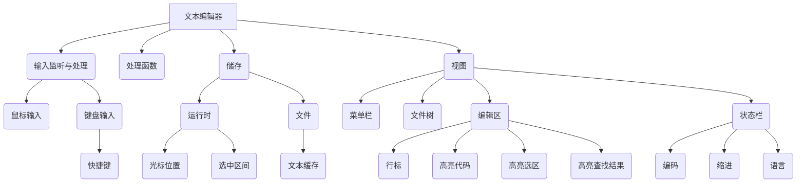
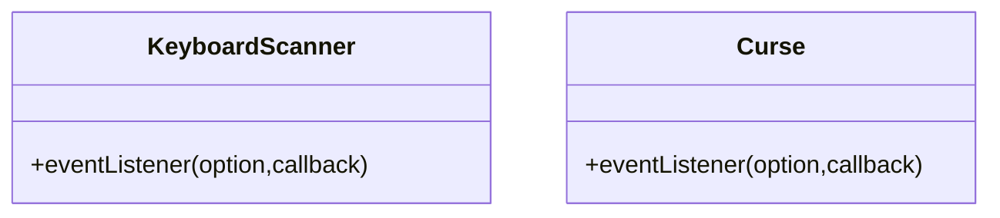
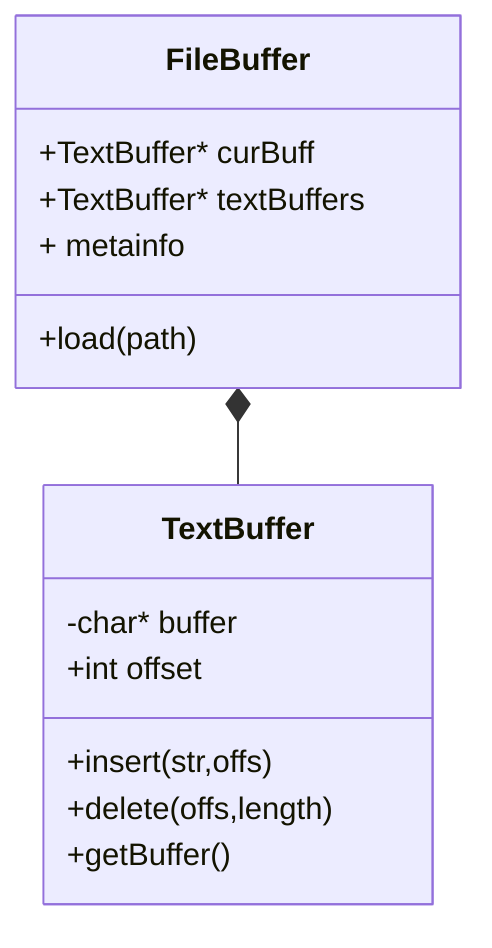

### Overall 总览

### [I] Input 输入

### [B2] Text Buffer 文本缓存

这里有几种策略

- [Gap Buffer](https://en.wikipedia.org/wiki/Gap_buffer) 与[Flexichain理论实现](https://www.common-lisp.net/project/flexichain/download/StrandhVilleneuveMoore.pdf)
- [Rope](https://en.wikipedia.org/wiki/Rope_(data_structure))
- Piece Table (主流数据结构)

本项目可使用单行Gap Buffer+TECO惰性读取的手法减少缓存复制开销。

把文本按行分成一个链表，光标所在的那一行是Gap Buffer，其他行是直接存的字符串。

### Rendered Text 渲染后结果

### Template

1. [Atom/Atom](https://github.com/atom/atom)
2. [Zedapp/Zed](https://github.com/zedapp/zed)

### References

1. Rob Pike, ‘The Text Editor,‘ [Sam](http://doc.cat-v.org/plan_9/4th_edition/papers/sam/).
2. Charles Crowley, [Data Structures for Text Sequences](https://www.cs.unm.edu/~crowley/papers/sds/sds.html).

